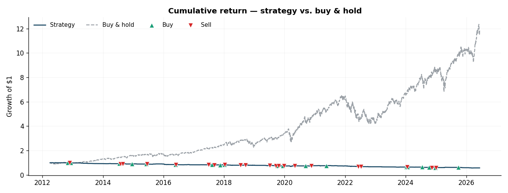
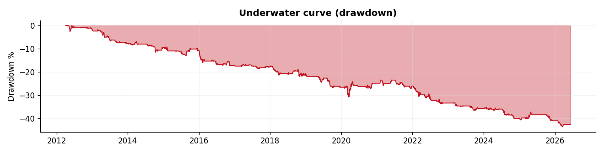
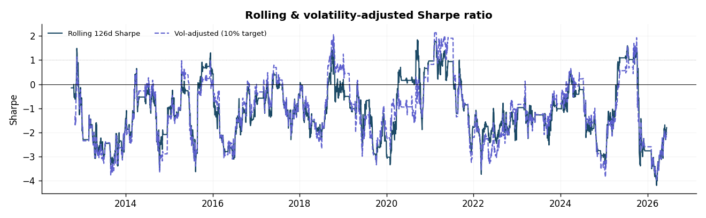
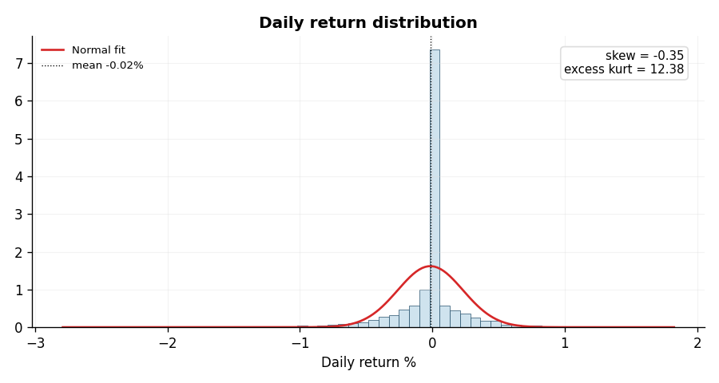
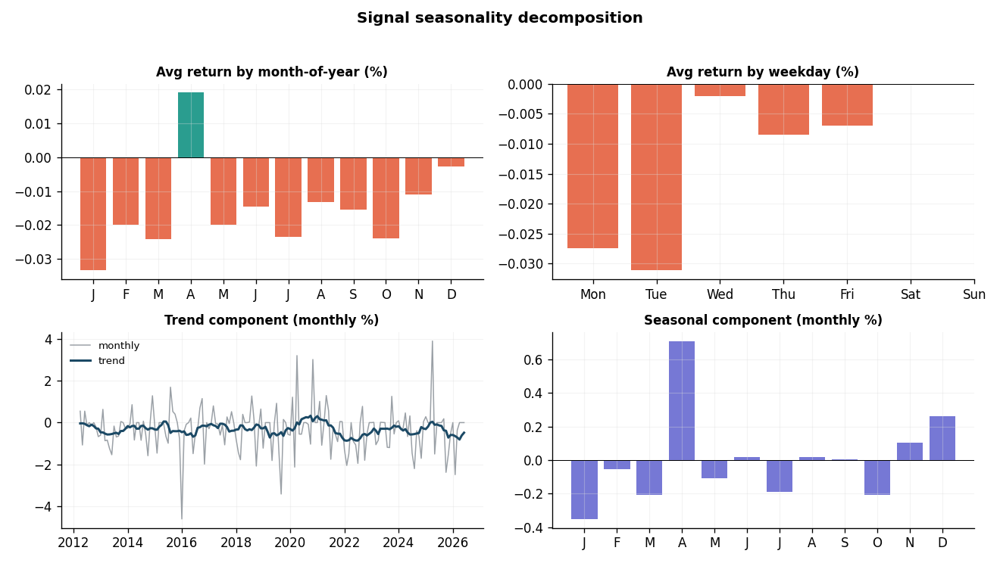
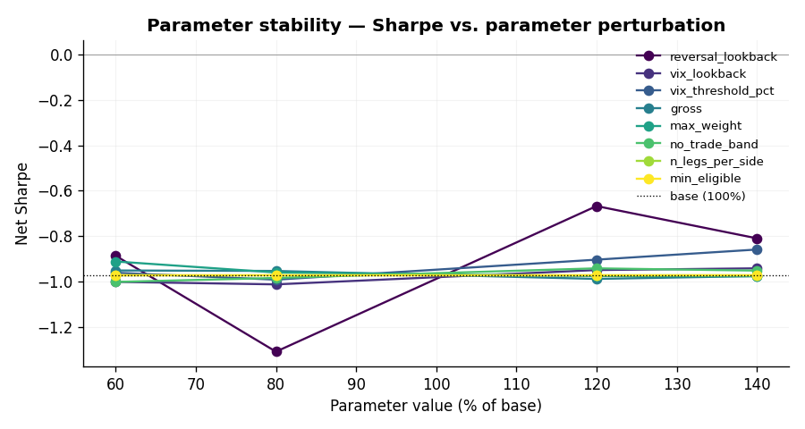
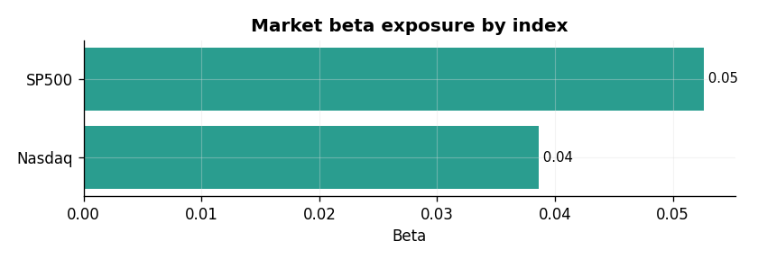

# Professional Backtest Report — Vol-Conditioned Sector Reversal

> **run_id** `995752b0`  ·  **window** 2012-04-03 → 2026-06-11 (3568 days, 14.2y)  ·  **verdict** `REVISE`
>
> _Presentation-grade companion to `02_BACKTEST_REPORT.md` — additive deliverable 03. Auto-generated; re-render with the report API. Math rendered with `$…$` / `$$…$$`._

---

## Executive Summary

| metric | value | | metric | value |
|---|---:|---|---|---:|
| Net Sharpe | **-0.972** | | Max drawdown | -43.56% |
| CAGR | -3.80% | | Max DD duration | 3523d |
| Annualized return | -3.80% | | Sortino | -1.287 |
| Annualized vol | 3.91% | | Calmar | -0.087 |
| Skewness | -0.35 | | Excess kurtosis | 12.38 |
| Win rate | 21.7% | | Edge vs baseline | -1.802 |

## Signal Definition & Mathematical Rationale

**Strategy:** Vol-Conditioned Sector Reversal
**Entrypoint:** `alpha_research.backtests.runners.vol_conditioned_reversal:build_weights`
**Universe:** XLK, XLF, XLE, XLV, XLC, XLY, XLP, XLI, XLB, XLRE, XLU  ·  **Benchmark:** SPY

Dollar-neutral cross-sectional 5-day reversal across the 11 SPDR sector ETFs, ACTIVE ONLY when VIX > its trailing-60-day median (else flat ~half the weeks). Long the worst recent sectors, short the best; weekly clock, t+1_open, no-trade band 0.05. Mechanism: liquidity provision to vol-constrained intermediaries in stress (Nagel 2012). COST-BOUND, not alpha-bound: expected NET Sharpe ~0.3-0.5, ~35-45% chance net<=0 at 2x stressed cost. Modal kills: MinBTL on the half-length high-VIX sub-sample (K9) and the 2x cost gate (K1). The EW baseline is long-only and carries the equity premium this market-neutral book does not -> K3 is a portfolio-contribution test (|rho| + marginal Sharpe), NOT a raw Sharpe-vs-EW comparison (PM R9). cost_model bps is a placeholder pending the engine's vol-conditional/$1-floor extension (D-COST).

### Weights contract

The strategy is expressed as an *unshifted* target-weight map; the engine applies the execution-convention shift so weights at date $t$ use only information available up to $t$:

$$ \mathbf{w}_t = f(\,\mathcal{P}_{\le t},\ \mathcal{M}_{\le t};\ \theta\,), \qquad \mathbf{w}^{\text{eff}}_t = \mathbf{w}_{t-k}, \quad k = \text{shift bars}. $$

Net portfolio return, after proportional costs on turnover $\tau_t = \sum_i |w^{\text{eff}}_{i,t} - w^{\text{eff}}_{i,t-1}|$:

$$ r^{\text{net}}_t = \sum_i w^{\text{eff}}_{i,t}\, r_{i,t} \;-\; c\cdot \tau_t, \qquad c = \tfrac{\text{cost bps}}{10^4}. $$

### Parameters $\theta$

| parameter | value |
|---|---|
| `reversal_lookback` | 5 |
| `vix_lookback` | 60 |
| `vix_threshold_pct` | 50 |
| `construction` | long_short |
| `gross` | 1.0 |
| `max_weight` | 0.2 |
| `no_trade_band` | 0.05 |
| `n_legs_per_side` | 0 |
| `min_eligible` | 5 |
| `mom_neutralize` | False |

## Methodology & Backtest Rigor

### Backtest horizon

- **Window:** 2012-04-03 → 2026-06-11
- **Length:** 3568 trading days (~14.2 years)
- **Walk-forward folds:** 4 contiguous out-of-sample segments, 0 positive — consistency is judged across folds, not on the full-sample number alone.

### Win probability

| measure | value | definition |
|---|---:|---|
| Daily win rate | 21.7% | $\Pr(r_t > 0)$ |
| Positive months | 25.7% | share of calendar months with $r>0$ |
| Profit factor | 0.78 | $\sum r^{+} / |\sum r^{-}|$ |
| Payoff ratio | 0.98 | avg win / avg loss |

_A win rate near 50% with a payoff ratio > 1 (or vice-versa) is normal; the two must be read together — neither alone establishes an edge._

### Data source

- **Provider:** quant_data.api (local-first)
- **Coverage:** 2012-01-03 → 2026-06-11
- **Universe / benchmark:** XLK, XLF, XLE, XLV, XLC, XLY, XLP, XLI, XLB, XLRE, XLU · benchmark SPY
- **Look-ahead control:** macro/FRED series are point-in-time shifted to their publication-availability date before they enter any signal.

### Backtest engine

- **Primary engine:** `weights_contract_vectorized` — a vectorized weights-contract backtester (`alpha_research.review.engine.run_weights_backtest`). Target weights at date $t$ use only data $\le t$; the engine applies the execution shift, so strategies never pre-shift their own output.
- **Execution convention:** t+1_open.
- **Cost model:** proportional 8.0bps, charged on one-way turnover each rebalance.
- **Validation engine(s):** event-driven (Backtrader adapter) — used only to cross-check the primary engine, never to produce headline numbers.
- **Reconciliation:** Independent event-driven replay of the vectorized engine: **reconciled ✅** (max daily-return divergence 0.0).

### How the backtest is carried out rigorously

1. **Data QC preflight** — missing-bar, stale-price, and extreme-return checks run before any signal is computed; a failing report blocks the run.
2. **No look-ahead by construction** — the weights contract forbids pre-shifting and PIT-shifts macro data; weights are lagged by the execution convention before earning returns.
3. **Costs and turnover** — net returns subtract proportional costs on realized turnover, and survival is re-tested at 1× / 2× / 3× the modelled cost.
4. **Naive-baseline comparison** — every result is benchmarked against a `equal_weight_11_sectors_weekly` alternative; edge is the Sharpe *above* that baseline, not the raw Sharpe.
5. **Multiple-testing control** — PSR, the Deflated Sharpe Ratio, and the Minimum Backtest Length deflate significance by the *effective* number of trials (n_trials = 24), so repeated searching cannot manufacture a pass.
6. **Robustness sweeps** — parameters are perturbed ±20/40% and Sharpe dispersion is reported; a result that only works at one setting is treated as fragile.
7. **Out-of-sample consistency** — walk-forward folds and regime-conditional Sharpe check that the edge is not concentrated in a single period or volatility regime.
8. **Independent reconciliation** — an event-driven replay must reproduce the vectorized engine's daily returns before the run is trusted.

## Visualization Deck

### Cumulative Return vs. Buy & Hold

_Strategy growth of $1 against a passive buy-and-hold benchmark; ▲ buys and ▼ sells mark the largest net-exposure changes._

### Drawdown

_Underwater curve — depth and duration of peak-to-trough losses._

### Rolling & Volatility-Adjusted Sharpe

_126-day rolling Sharpe and a 10%-vol-targeted variant; stability of the edge over time._

### Return Distribution (Skew & Kurtosis)

_Daily-return histogram vs. a fitted normal, annotated with the realized skewness and excess kurtosis._

### Signal Seasonality Decomposition

_Month-of-year and weekday seasonality plus an additive trend/seasonal split of the monthly return series._

### Parameter Stability

_Sharpe response to ±20/40% parameter perturbations — fragility diagnostic._

### Beta Exposure by Index

_OLS beta of strategy returns to each market index (S&P 500, Nasdaq, …)._

## Statistical Moments & Risk Definitions

| moment / ratio | formula | value |
|---|---|---|
| Annualized Sharpe | $\sqrt{252}\,\bar r / \sigma_r$ | -0.972 |
| Sortino | $\sqrt{252}\,\bar r / \sigma_{\text{down}}$ | -1.287 |
| Calmar | $\text{CAGR} / |\text{MaxDD}|$ | -0.087 |
| Skewness | $\mathbb{E}[(r-\bar r)^3]/\sigma_r^3$ | -0.35 |
| Excess kurtosis | $\mathbb{E}[(r-\bar r)^4]/\sigma_r^4 - 3$ | 12.38 |
| 95% VaR (daily) | $-Q_{0.05}(r)$ | -0.43% |
| 95% CVaR (daily) | $\mathbb{E}[r \mid r \le Q_{0.05}]$ | -0.67% |
| Tail ratio | $|Q_{0.95}| / |Q_{0.05}|$ | 0.83 |
| Max drawdown | $\min_t (E_t/\max_{s\le t}E_s - 1)$ | -43.56% |
| CAGR | $(E_T/E_0)^{252/n}-1$ | -3.80% |

_Beta vs. index $j$: $\beta_j = \operatorname{Cov}(r, r^{(j)}) / \operatorname{Var}(r^{(j)})$. Volatility-adjusted Sharpe rescales daily returns to a constant 10% annualized target vol using trailing 21-day realized vol (lagged one day) before computing the rolling ratio._

## Beta Exposure (multi-index)

| index | beta |
|---|---:|
| Nasdaq | 0.039 |
| SP500 | 0.053 |

## Parameter Stability

_Parameter “volatility” = standard deviation of net Sharpe across the ±20/40% perturbation grid (lower is more robust)._

| parameter | Sharpe σ |
|---|---:|
| `reversal_lookback` | 0.239 |
| `vix_threshold_pct` | 0.051 |
| `vix_lookback` | 0.031 |
| `max_weight` | 0.027 |
| `no_trade_band` | 0.024 |
| `gross` | 0.016 |
| `n_legs_per_side` | 0.000 |
| `min_eligible` | 0.000 |

## Seasonality — average daily return by month

| Jan | Feb | Mar | Apr | May | Jun | Jul | Aug | Sep | Oct | Nov | Dec |
|---|---|---|---|---|---|---|---|---|---|---|---|
| -0.033% | -0.020% | -0.024% | 0.019% | -0.020% | -0.015% | -0.024% | -0.013% | -0.016% | -0.024% | -0.011% | -0.003% |

## Portfolio Manager Review

_Generated from the run artifacts — a structured reading of the numbers, not a substitute for the reviewing PM's judgement._

- **Risk-adjusted return.** Net Sharpe of **-0.972** is a negative result; Sortino -1.287 and Calmar -0.087 corroborate the downside-aware picture.
- **Edge vs. naive baseline.** The strategy fails to beat the equal-weight baseline (ΔSharpe = -1.802). A small or negative gap means most of the return is beta the baseline already captures.
- **Tail profile.** Returns are left-skewed (crash-prone), fat-tailed (skew -0.35, excess kurtosis 12.38); 95% CVaR -0.67% sizes the expected bad-day loss.
- **Drawdown.** Worst peak-to-trough was -43.56% over 3523 days, with 99% of the sample spent underwater — the capital-at-risk a PM must be willing to sit through.
- **Cost robustness.** At 3.0× modelled costs the net Sharpe is -2.212 — breaks down under realistic frictions.
- **Statistical significance.** PSR 0.0%, DSR 0.000 (n_trials=24), MinBTL NOT satisfied; walk-forward positive in 0/4 segments — consistency across the sample, not a single lucky regime.
- **Parameter stability.** Sharpe dispersion across perturbations is largest for `reversal_lookback` (σ = 0.239). Low dispersion is evidence the edge is not an artefact of a single fragile setting.
- **Market exposure.** Largest index beta is to SP500 (0.05); net directional exposure should be reconciled against the strategy's intended market-neutrality (or lack thereof).
- **Gate verdict.** Pre-committed promotion gates: **REVISE** (1/5 passed). Promotion to paper remains a human decision.

---

_Definitions: Sharpe/Sortino annualized with 252 trading days; VaR/CVaR at the 5% daily quantile; beta via OLS covariance; volatility-adjusted Sharpe targets 10% annualized vol using trailing 21-day realized vol (lagged). This report reads the existing run bundle and does not alter the backtest engine or `02_BACKTEST_REPORT.md`._
